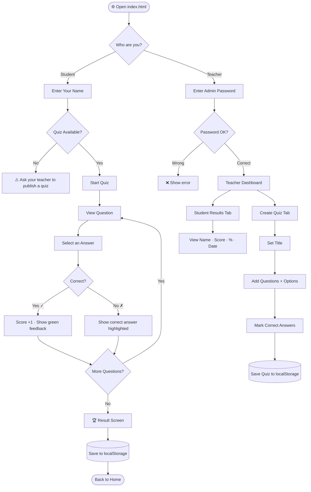
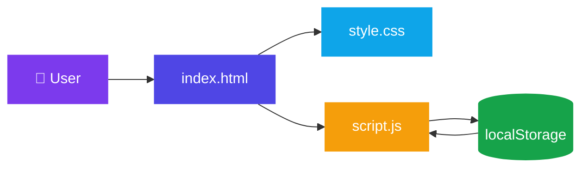
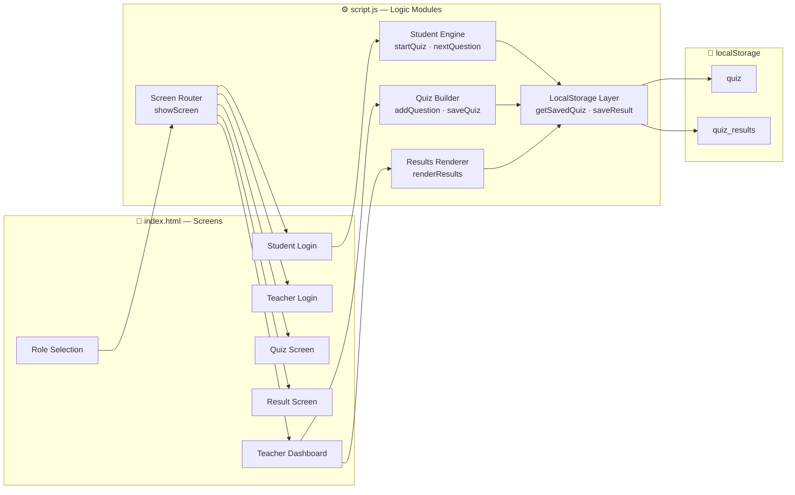
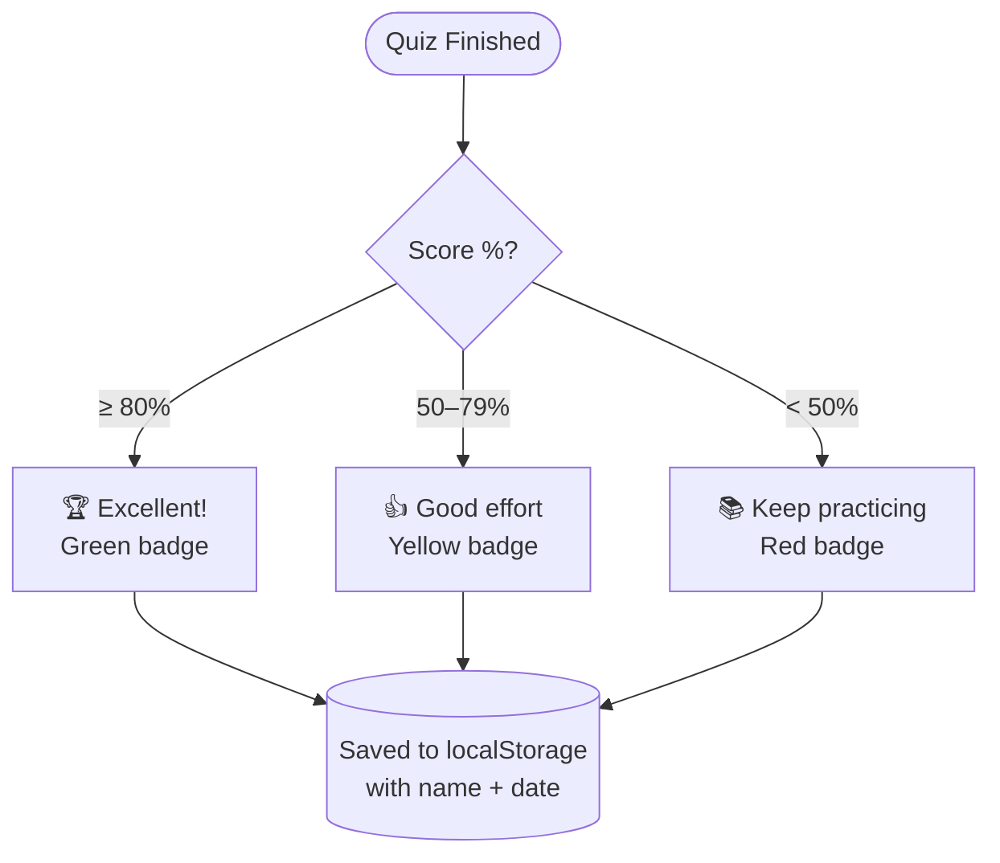
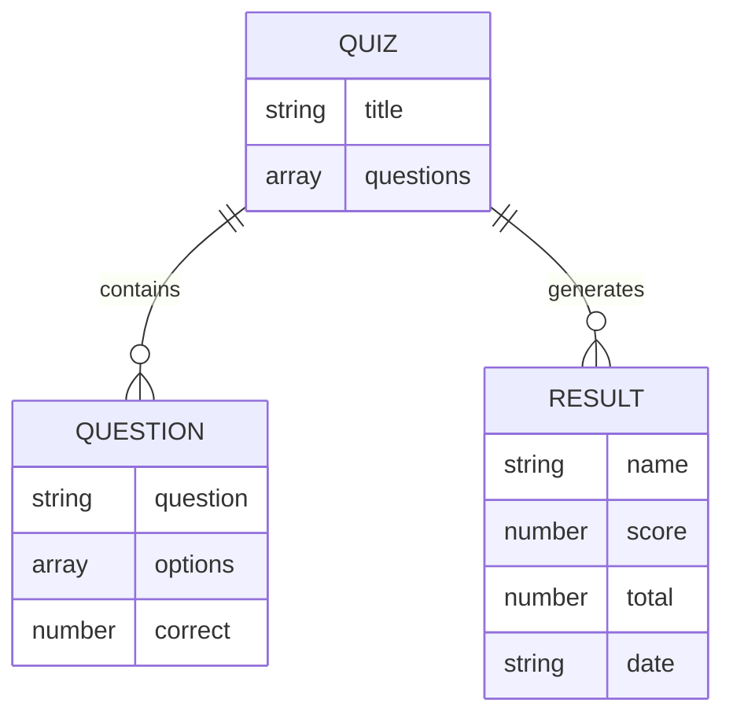

# QuizHub — Interactive Quiz Platform

> A lightweight, zero-dependency quiz platform built entirely with vanilla HTML, CSS, and JavaScript — no frameworks, no build tools, no backend required.

---

## Live Demo

Open `index.html` directly in any modern browser. No installation needed.

---

## Overview

QuizHub is a role-based quiz platform that allows teachers to create and publish quizzes, and students to take them and receive instant feedback. All data is persisted client-side using the browser's `localStorage` API.

This project demonstrates that complex, polished web applications can be built without relying on modern JavaScript frameworks — just clean, well-structured vanilla code.

---

## User Flow



---

## Features

### Student Experience
- Enter name to begin — no account creation required
- Answer multiple-choice questions one at a time
- Instant visual feedback per question (correct answer highlighted)
- Final score screen with percentage and personalized message
- Results automatically saved for the teacher to review

### Teacher / Admin Dashboard
- Password-protected access
- **Quiz Builder** — set a quiz title, add unlimited questions, define 4 options per question, and mark the correct answer via radio button
- **Live validation** — catches empty fields before saving
- **Student Results** — view a full table of every student's name, score, percentage badge, and submission date
- Clear all results with one click

---

## Role Access

| Role    | Access         | Credential              |
|---------|----------------|-------------------------|
| Student | Quiz only      | Name entry              |
| Teacher | Full dashboard | Password: `admin123`    |

---

## Tech Stack



| Layer        | Technology                                          |
|--------------|-----------------------------------------------------|
| Markup       | HTML5 (semantic)                                    |
| Styling      | CSS3 (Flexbox, transitions, animations, responsive) |
| Logic        | Vanilla JavaScript (ES6+)                           |
| Persistence  | Browser `localStorage`                              |
| Dependencies | **None**                                            |

---

## Project Structure

```
quizhub/
├── index.html   # All markup — screens, quiz UI, teacher dashboard
├── style.css    # Full design system — layout, components, badges, responsive
└── script.js    # All application logic — routing, quiz engine, results
```

---

## Application Architecture



---

## Score Grading Logic



---

## Key Engineering Decisions

- **Screen routing without a router** — Each "page" is a hidden `div`. A single `showScreen(id)` function toggles CSS classes with a fade-in animation, simulating SPA navigation.
- **Component-style question builder** — Questions are dynamically generated DOM nodes, each self-contained with its own input references and radio group name-spacing.
- **Stateless quiz engine** — Quiz state (current question, score, student name) lives in module-level variables and resets cleanly on `restartApp()`, avoiding stale state bugs.
- **XSS prevention** — All user-provided text is passed through `escapeHtml()` before rendering into the DOM.
- **LocalStorage as a simple data layer** — Quiz data and results are JSON-serialized objects. The schema is minimal and flat — no migrations needed.

---

## Data Schema



---

## Getting Started

```bash
# No setup required — just open the file
open index.html
```

Or drag `index.html` into any browser window.

---

## Possible Extensions

- [ ] Timer per question or per quiz
- [ ] Multiple quiz support (quiz bank)
- [ ] Export results to CSV
- [ ] Randomized question order
- [ ] Backend integration (Node.js + PostgreSQL) for multi-device persistence
- [ ] JWT-based auth to replace the static password

---

## Author

Built with care using nothing but the fundamentals — because great software doesn't always need a framework.
